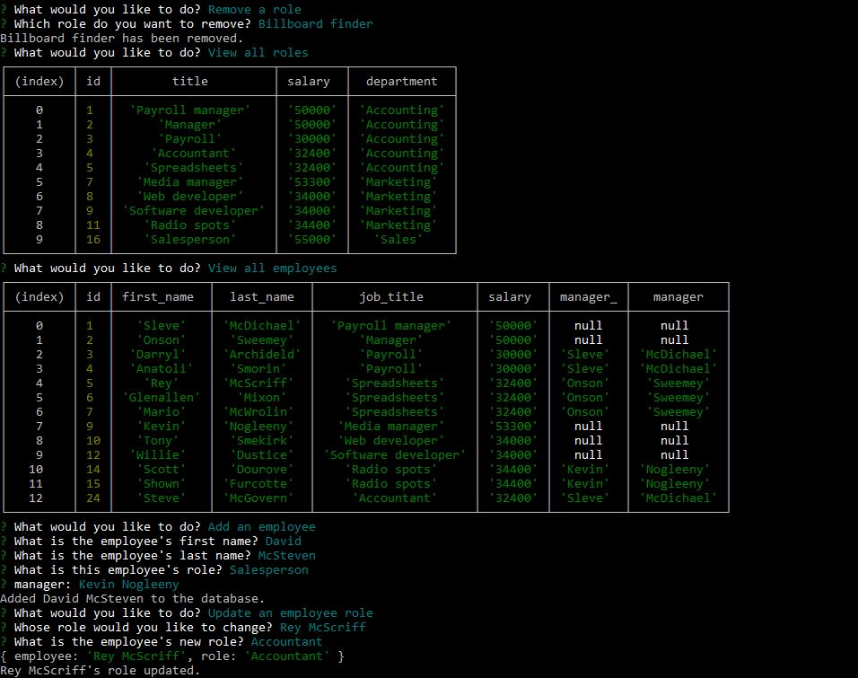

# employee-tracker

## Description
  This application facilitates keeping track of employees for a company. Departments, roles, and employees and be listed, add, and removed.

  ## Table of Contents
  *[Installation](#installation)

  *[Usage](#usage)

  *[Links](#links)

  ## Installation
    This application requires node.js, express.js, inquirer, console.table, and mysql to run.

  ## Usage
  Run node index.js and a series of options will be given to you. Simply answer the prompts and the progam will handle the rest. Select quit when you are done.
  

  ## Links

  [GitHub](https://github.com/Dustin2400/employee-tracker)

  [Heroku](https://watch.screencastify.com/v/vd05SwIFRnQtKmvUw7id)

##
  Made with ❤️ by Dustin Grijalva